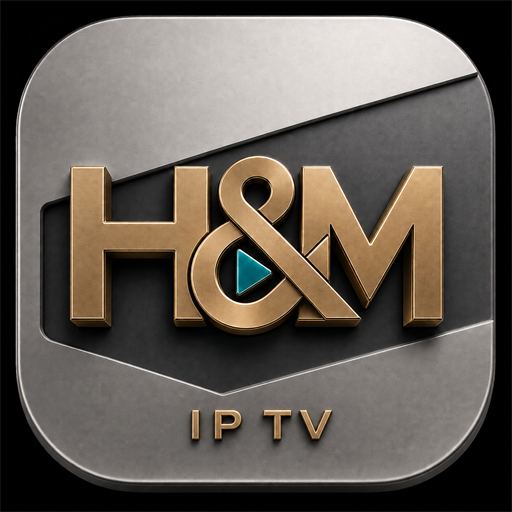

<p align="center">
  
</p>

<h1 align="center">H&amp;M IPTV Player</h1>

<p align="center">
  Samsung Tizen televizyonlar için hızlı, kumanda odaklı ve modern IPTV oynatıcısı.
</p>

<p align="center">
  
  
  
</p>

## Genel bakış

H&M Player; Xtream Codes uyumlu IPTV servislerindeki canlı yayınları, filmleri
ve dizileri Samsung televizyon kumandasıyla rahatça kullanmak için geliştirilmiş
bir Tizen uygulamasıdır. Arayüz, eski TV donanımlarını da gözeterek hafif
tutulurken VOD ayrıntıları ve oynatıcı deneyimi modernleştirilmiştir.

Public v2, projenin genel kullanıma açık yeni başlangıç sürümüdür. Önceki özel
Family v1.x hattının Git geçmişi, paketleri ve gizli yapılandırmaları bu depoya
taşınmamıştır; bu depodaki geliştirme v2.0.0'dan itibaren takip edilir.

## Öne çıkan özellikler

- Canlı TV, film ve dizi desteği
- Kumandayla hızlı kategori, kart, liste ve sayfa gezinmesi
- Favoriler, son izlenenler ve kaldığı yerden devam etme
- EPG, kanal geçmişi ve hızlı kanal değiştirme
- Film ve dizi arama, kategori bilgisi, sıralama ve görünüm filtreleri
- Sinematik VOD ayrıntı sayfaları, sezon ve bölüm listeleri
- TMDb puanı, oyuncular, özet, arka plan ve platform bilgileri
- Çoklu ses ve altyazı seçimi; TX3G uyumluluk yolu
- AVPlay ve HTML5 oynatma yolları
- En-boy oranı, ileri/geri sarma ve gelişmiş oynatıcı kontrolleri
- Tizen 6 / Chromium 76 uyumluluğunu koruyan regresyon testleri

## Public v2 ve TMDb

Public sürüm, kullanıcıdan ortak bir TMDb anahtarı istemeden zengin içerik
bilgilerini gösterebilir. Uygulama yalnızca izin verilen istekleri Cloudflare
Worker üzerinden TMDb'ye iletir.

```text
Samsung TV uygulaması
        │
        ├── IPTV sağlayıcısı ── canlı yayın / film / dizi
        │
        └── Cloudflare Worker ── izinli ve önbellekli TMDb istekleri
                                      │
                                      └── TMDb API
```

TMDb kimlik bilgisi yalnızca Cloudflare secret içinde tutulur. Kaynak kodda,
Git geçmişinde veya WGT paketinde yer almaz. Proxy:

- Yalnızca uygulamanın kullandığı TMDb yollarını kabul eder.
- Bilinmeyen yolları ve sorgu parametrelerini reddeder.
- İstemciden gönderilen `api_key` parametresini kabul etmez.
- Başarılı yanıtları uygun sürelerle Cloudflare önbelleğine alır.
- İsteyen kullanıcının kendi kişisel TMDb anahtarını kullanmasına engel olmaz.

Worker'ın sağlık durumu:
[hm-player-tmdb-proxy](https://hm-player-tmdb-proxy.hakanveli.workers.dev/health)

## Uyumluluk

- Hedef platform: Samsung Tizen TV
- Doğrulanan temel ortam: Tizen 6 / Chromium 76
- Uygulama profili: `tv-samsung`
- Paket biçimi: `.wgt`

Yeni Tizen sürümlerinde geriye dönük web ve AVPlay uyumluluğu hedeflenmektedir.
IPTV sağlayıcısının akış biçimi, codec yapısı ve sunucu davranışı oynatma
sonucunu etkileyebilir.

## Kaynaktan doğrulama ve paketleme

Gereksinimler:

- Node.js ve npm
- WGT'yi televizyona kurmak veya imzalamak için Samsung Tizen araçları

Projeyi alın ve bağımlılıkları kurun:

```bash
git clone https://github.com/hakanveli06/IP-TV-Player-CH.git
cd IP-TV-Player-CH
npm install --prefix worker
```

Tüm testleri, Worker dry-run kontrolünü, kaynak güvenlik taramasını ve WGT
denetimini birlikte çalıştırın:

```bash
npm run verify
```

Yalnızca Public WGT üretmek için:

```bash
npm run build
```

Çıktı:

```text
dist/HM_Player_v2.0.0_Public.wgt
```

Derleme çıktıları Git'e eklenmez. Dağıtılacak paketlerin GitHub Releases
üzerinden yayımlanması hedeflenir.

## Worker geliştirme

Worker kaynakları [`worker`](worker) klasöründedir. Yerel test ve dağıtım:

```bash
npm --prefix worker test
npm --prefix worker run check
npm --prefix worker run deploy
```

Gerçek TMDb değeri yapılandırma dosyasına yazılmaz:

```bash
cd worker
npx wrangler secret put TMDB_READ_TOKEN
```

Ayrıntılı kurulum için
[`docs/tmdb-proxy.tr.md`](docs/tmdb-proxy.tr.md) belgesine bakın.

## Proje yapısı

```text
assets/       Uygulama görselleri
css/          Tizen arayüz stilleri
docs/         Teknik kurulum belgeleri
js/           Uygulama, görünüm, oynatıcı ve TMDb istemcisi
service/      Paket içi yerel uyumluluk servisi
tools/        Derleme, test, denetim ve teşhis araçları
worker/       Public TMDb Cloudflare Worker'ı
```

## Güvenlik ve gizlilik

- Ortak TMDb anahtarı kaynak kodda veya WGT içinde bulunmaz.
- IPTV hesap bilgileri kullanıcı tarafından doğrudan uygulamaya girilir.
- Public kaynak ve paket denetimleri olası sabit anahtarları reddeder.
- Kişisel TMDb anahtarı tercih edilirse televizyonun yerel ayarlarında saklanır.
- Hata raporlarına IPTV parolası veya erişim anahtarı eklenmemelidir.

## Sorun bildirimi

Bir hata bildirirken TV modeli, Tizen sürümü, uygulama sürümü, içerik türü ve
tekrar adımlarını belirtin. IPTV kullanıcı adı, parola, sunucu anahtarı veya
TMDb anahtarını paylaşmayın.

[Yeni sorun bildirin](https://github.com/hakanveli06/IP-TV-Player-CH/issues/new)

## Veri kaynakları

This product uses the TMDB API but is not endorsed or certified by TMDB.

Streaming availability data shown by TMDb is provided by JustWatch.
